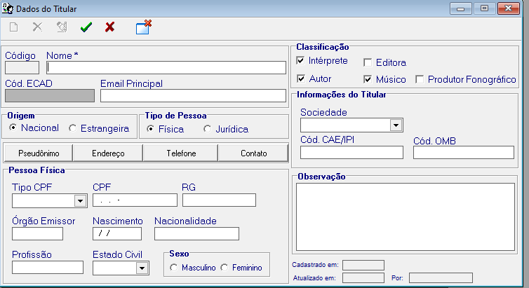
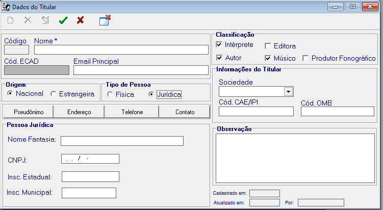
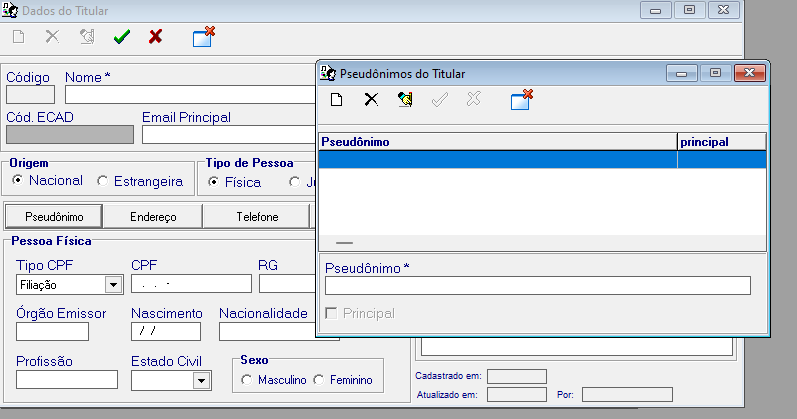

# FonoWeb

## Index

1. [How the SISRC system work](#how-the-sisrc-system-work-)
2. [Users](#users)
2. [Holders](#holders)
3. [Works](#works)
4. [Poutporrit](#poutporrit-)
5. [Collective](#collective)
6. [Phonograms](#phonograms)

# How the SISRC system work

The FonoWeb system is an attempt to converter the already existing desktop system into Web system.

In this documentation only detail the conversion, to learn more about the system SISRC, please see the
[documentaton](https://pro-musicabr.org.br/isrc/pt-br/why-use/isrc-administration/index.html) and the
[documentation](./manualISRC.pdf)

In summary, the final function of the SISRC system is to generate an export with the phonogram information, in text
format that must be
sent to ECAD.

# Users

Users are the managers of the Phonograms production companies.  
Users can manage can more than one Phonograms production company.  
Users information can only be seen by the owner of information or members of the group to which the owner is a member.

# Holders

Holders are the primary part of the registry.  
Holders can be physical person or legal person

## Physical person

### CPF

### NOTE

The **'Filiação'** option is not used.  
The **'Responsável'** option is used when the CPF of the holder is not known, in this case the CPF of
who is registering.  
There is a CSV file, in [fonoweb/bases/ISRC_sociedade_tb.csv](../bases/ISRC_sociedade_tb.csv), which contains the
information for the **'Sociedade'** field.

**Tips**
manage loaddata

## Legal person

The Address, Telephone and Contact fields are not used, however, for study reasons, we can implement them.

## Pseudonym

The relationship between the holder and pseudonym is MANY to ONE, **in short** a holder can have several pseudonym
and one pseudonym can be linked to only one holder.

# Works

# Poutporrit

# Collective

# Phonograms